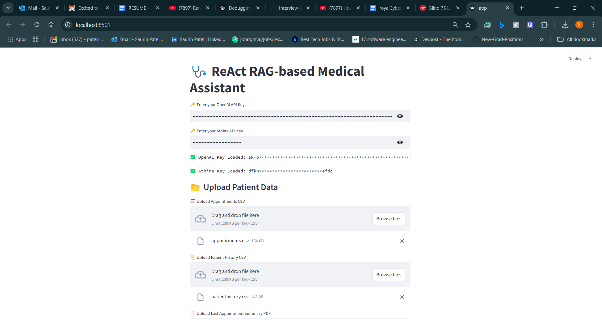
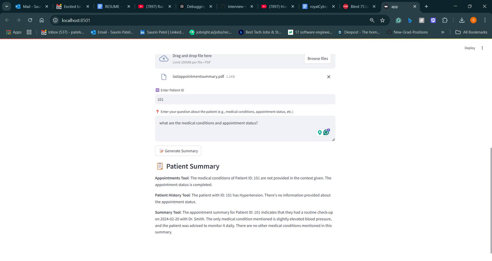

# 🩺 ReAct RAG-based Medical Assistant

## Overview

This project implements a **ReAct RAG-based Medical Assistant** using **LangChain** and **OpenAI's GPT-4**. The assistant is designed to retrieve relevant patient data and answer queries about a specific patient, such as medical history, appointments, and other summaries. The core of the system leverages **Retrieval-Augmented Generation (RAG)** to enhance the capabilities of a language model with relevant data extracted from patient files.

### Features
- **Patient ID-based queries**: The assistant responds to patient-specific queries using the patient ID.
- **Multiple data sources**: Queries are answered by retrieving data from multiple sources, such as appointments, medical history, and appointment summaries.
- **Parallel data processing**: Multiple queries are processed in parallel, significantly reducing response times.
- **Intuitive interface**: Users can upload patient data in CSV and PDF formats for processing.

## Technologies Used
- **OpenAI GPT-4**: For generating responses based on retrieved data.
- **LangChain**: For managing document processing and retrieval tasks.
- **FAISS**: For efficient vector store management and fast retrieval.
- **Streamlit**: For creating an interactive web interface.
- **Athina API**: For integrating additional APIs and tools.
- **Python**: The backend of the project is written in Python.

## Installation

To run the project locally, follow the steps below:

### Prerequisites
- Python 3.8+
- OpenAI API key
- Athina API key

### Step 1: Clone the repository
```bash
git clone https://github.com/yourusername/react-rag-medical-assistant.git
cd react-rag-medical-assistant
```

### Step 2: Install dependencies
```bash
pip install -r requirements.txt
```

### Step 3: Set up API keys
- Set up your **OpenAI API key** and **Athina API key** by entering them in the respective text input fields on the Streamlit interface.
- The keys will be automatically loaded into the environment.

### Step 4: Run the app
```bash
streamlit run app.py
```

### Step 5: Upload patient data
- Upload CSV files for **Appointments** and **Patient History**, and a **PDF** for the **Last Appointment Summary**.

## Usage

1. **Enter Patient ID**: In the app interface, enter the **Patient ID** to fetch details.
2. **Ask Questions**: After entering the Patient ID, you can ask questions like:
   - "What is the patient's medical history?"
   - "When was the patient's last appointment?"
   - "What medications is the patient taking?"
3. **View Results**: The assistant will provide answers based on the relevant documents retrieved from the uploaded files.

## Screenshots

### Patient Summary Results





## Contributing

If you would like to contribute to this project, feel free to fork the repository, create a new branch, and submit a pull request with your proposed changes.

### To Do
- Implement more advanced query processing logic (e.g., more specific query templates).
- Improve the interface to make it more user-friendly.
- Add additional data validation and error handling.

## License

This project is licensed under the MIT License - see the [LICENSE](LICENSE) file for details.
